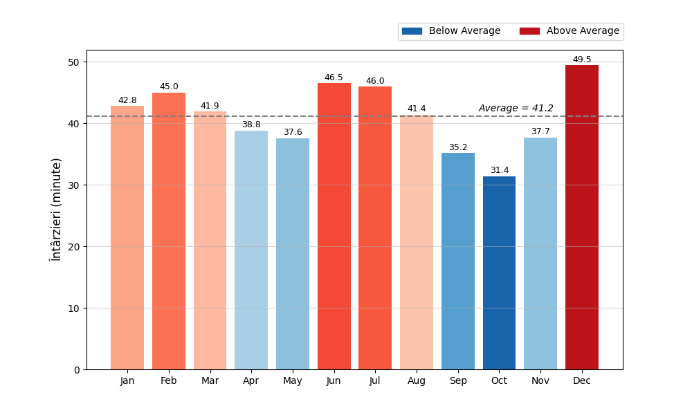

# Airline Delay Analysis

This repository contains a script that processes airline delay data and creates a bar chart showing the average delay per month in gradient colors.

Above average is red and the intensity grows the higher it is
Below average is blue and the intensity grows the lower it is

## Instructions

1. **Download CSV:**  
   Download the CSV file from the Kaggle dataset:  
   [Airline Delay Causes](https://www.kaggle.com/datasets/giovamata/airlinedelaycauses)

2. **Place CSV at Root:**  
   Ensure the downloaded CSV file (e.g., `DelayedFlights.csv`) is placed in the root directory of this repository.

3. **Output:**
   

